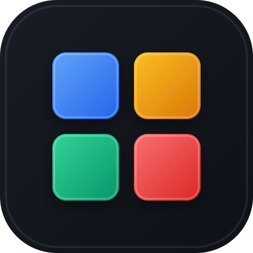

# 🧱 BLOCK BLAST — Casual Puzzle PWA

A modern, tactile, commercial-grade casual block puzzle game inspired by **Block Blast**, crafted with minimalist Apple-grade aesthetics, responsive touch mechanics, procedural Web Audio sound synthesis, dynamic theme progression, and full offline PWA support.



---

## ✨ Features

- **8×8 Puzzle Grid**: Tactile block bevels, recessed socket styling, and smooth placement bounce animations.
- **Dynamic Theme Progression**: Unlocks 6 progressive art-directed themes (Midnight, Ocean, Sunset, Forest, Minimal Dawn, and Aurora) via **Full Board Clears** and score milestones.
- **Simultaneous Row & Column Clears**: Combos and multi-line blasts with escalating multipliers (`COMBO x2`, `COMBO x3`...).
- **Mobile-First Touch Ergonomics**: 75px vertical touch offset so thumbs never block target grid cells during dragging.
- **Procedural Web Audio Engine**: Zero external audio files (100% offline reliable), featuring melodic pentatonic chords that rise with combo streaks.
- **Installable PWA**: Precached service worker (`sw.js`), Web App Manifest, standalone display, and offline persistence.
- **Vercel & GitHub Ready**: Pre-configured `vercel.json` and optimized base path.

---

## 🚀 Quick Start

### 1. Install Dependencies
```bash
npm install
```

### 2. Run Local Dev Server
```bash
npm run dev
```
Open [http://localhost:5173](http://localhost:5173) in your browser.

### 3. Build for Production
```bash
npm run build
```
Production assets are generated in `dist/`.

---

## 🌐 Deploy to Vercel

### Option 1: Via GitHub (Recommended)
1. Push this repository to GitHub:
   ```bash
   git add .
   git commit -m "feat: initial release of Block Blast PWA"
   git branch -M main
   git remote add origin https://github.com/<your-username>/<your-repo-name>.git
   git push -u origin main
   ```
2. Go to [vercel.com](https://vercel.com) and click **"Add New Project"**.
3. Import your GitHub repository.
4. Vercel will automatically detect:
   - **Framework Preset**: `Vite`
   - **Build Command**: `npm run build`
   - **Output Directory**: `dist`
5. Click **"Deploy"**!

### Option 2: Via Vercel CLI
```bash
npx vercel
```
Follow the prompts to deploy directly from your terminal.

---

## 🛠 Tech Stack

- **Framework**: React 19 + TypeScript
- **Bundler**: Vite
- **PWA & Service Worker**: `vite-plugin-pwa` + Workbox
- **Audio Engine**: Web Audio API (procedural oscillators & envelopes)
- **Styling**: Vanilla CSS Variables & Design Tokens (Dark & Light themes)
- **Effects**: `canvas-confetti`
